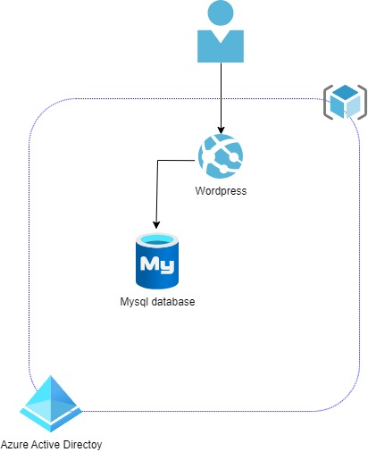
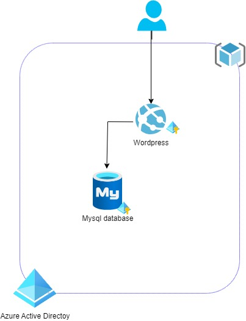
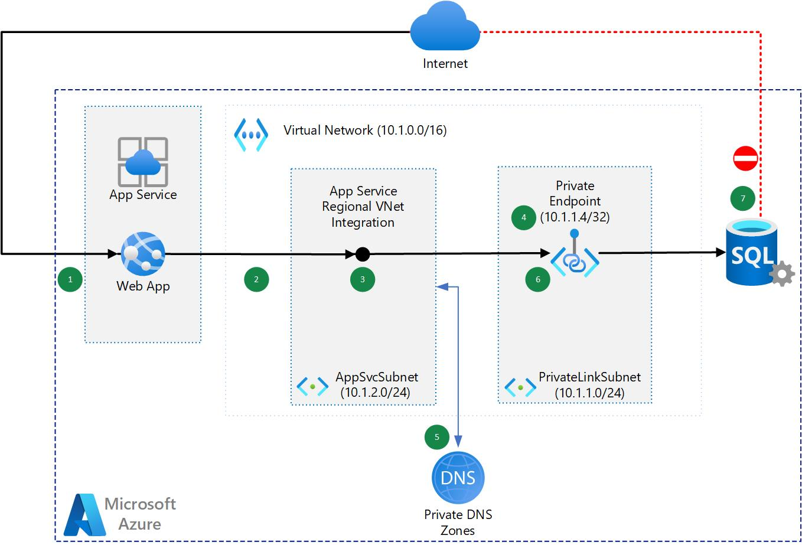
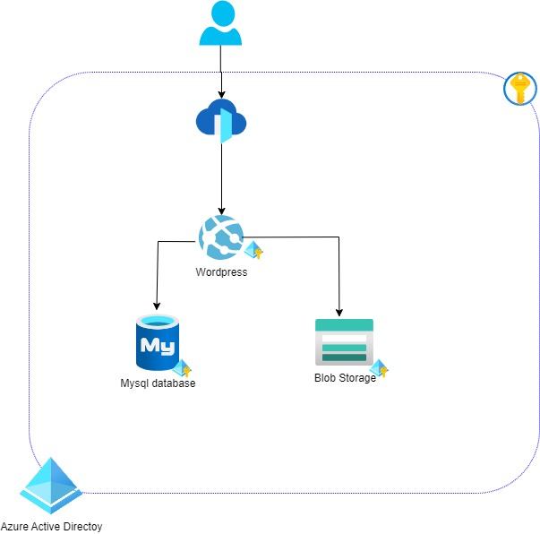
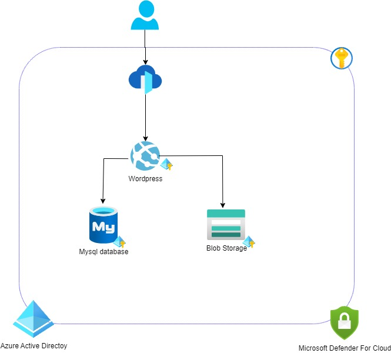

# :muscle: Demo - Zero Trust deployment of Wordpress in Azure for CTO Day

## Introduction

Demo of security configuration of Wordpress with Azure security modules
## Repository Contents
.devcontainer: 
- description of [devcontainer execution container used in vscode](https://code.visualstudio.com/docs/remote/create-dev-container)
- this container allow you to have a remote dev env for terraform within VSCODE

terraform: 
- all tf scripts 
- bash-scripts subdirectory (containing some scripts to setup azure env and execute tf)
- dev subdirectory: containing variables TF files for connexion to Azure env


## :raising_hand: Challenge 0 : [Prerequis](./Challenge%200/Challenge0.md)

We have compiled a list of common tools and software that will come in handy to complete this Azure Hack

- [Windows Subsystem for Linux](https://docs.microsoft.com/fr-fr/windows/wsl/install)
  - [HomeBrew for Linux](https://brew.sh/)
  - Terraform binaire installed in the WSL Linux: 
```
brew install terraform
```
- [Managing Cloud Resources](https://docs.microsoft.com/fr-fr/azure/azure-resource-manager/)
  - [Azure Portal](https://portal.azure.com)
- [Visual Studio Code](https://code.visualstudio.com/Download)
- [Docker for Windows](https://www.docker.com/products/docker-desktop/) or [Docker for MacOs](https://www.docker.com/products/docker-desktop/) or [Docker for Linux](https://www.docker.com/products/docker-desktop/)

## Description

Now that you have the common pre-requisites installed on your workstation, there are prerequisites specifc to this hack.

Please do these additional setup:

## Setup and create scripts files

Those steps have to be done ONCE only (except if you destroy the Ressource Group hosting the TF State files).
Your "terraform" process will need to store the tfstate file somewhere. In an Enterprise Scale Landing Zone, this should be hosted in a blob storage in a secured central place, generally in the Adminstration subscription. 
### Setup Azure TF backend:

```
#!/bin/bash

RESOURCE_GROUP_NAME=put your RG Name for hosting the storage account for your TF state file
STORAGE_ACCOUNT_NAME=put the name of the storage account for your TF state file
CONTAINER_NAME=put the name of the storage container to host your TF state file
LOC01=francecentral
ACCOUNT=put the name of the subscription that will host the storage account for TF state file

az login

az account set -s $ACCOUNT

# Create resource group
az group create --name $RESOURCE_GROUP_NAME --location $LOC01

# Create storage account
az storage account create --resource-group $RESOURCE_GROUP_NAME --name $STORAGE_ACCOUNT_NAME --sku Standard_LRS --encryption-services blob

# Get storage account key
ACCOUNT_KEY=$(az storage account keys list --resource-group $RESOURCE_GROUP_NAME --account-name $STORAGE_ACCOUNT_NAME --query [0].value -o tsv)

# Create blob container
az storage container create --name $CONTAINER_NAME --account-name $STORAGE_ACCOUNT_NAME --account-key $ACCOUNT_KEY

echo "storage_account_name: $STORAGE_ACCOUNT_NAME"
echo "container_name: $CONTAINER_NAME"
echo "access_key: $ACCOUNT_KEY"
```

As we are achieving this workshop using Infra as Code with Terraform, to allow terraform process to connect and deploy resources, we need to provide it an Identity:
### Create an SPN to represent your Terraform application
```
# Azure AD SPN creation
# https://registry.terraform.io/providers/hashicorp/azurerm/latest/docs/guides/service_principal_client_secret#creating-a-service-principal-using-the-azure-cli
az ad sp create-for-rbac --name tf-spn01 --role="Owner" --scopes="/subscriptions/id_of_the_demo_subscription"
```
<span style="color:red">The **"Owner"** role is given on the subscription for ease and as **it is DEMO**</span>

You need to restrict based on your security practice for Azure RBAC.
### Create Back End variables files

- Create a beconf.tfvars file in dev directory

```
resource_group_name  = "name of the resource group hosting your storage account"
storage_account_name = "name of your storage account"
container_name       = "name of the storage container you create in the previous step"
key                  = "name of the blob where the TF state will be stored"
access_key           = "access key you get from storage creation in the previous step"
```

- Create a connexion-var.tf file in dev directory

```
subscription_id = "id of the subscription hosting the tf state file"
subscription_id_demo = "id of the subscription hosting the demo"

client_id="client id of the AAD SPN Created to represent your terraform process"
client_secret="client secret of the AAD SPN Created to represent your terraform process"
tenant_id="AAD tenant id that host the SPN representing your terraform process"
```

## Terraform command

```
## Terraform initialise backend
terraform init -backend-config dev/beconf.tfvars -reconfigure
## terraform init with upgrade module version
# terraform init -upgrade -backend-config dev/beconf.tfvars -reconfigure
## terraform check files
# terraform fmt -check -recursive
## terraform plan deploiement
terraform plan -var-file dev/connexion-var.tf
## terraform effective deploiement
terraform apply -var-file dev/connexion-var.tf -auto-approve
## terraform delete deploiement
## WARNING: every AZURE resource will be deleted ....
# terraform apply -var-file dev/connexion-var.tf -destroy -auto-approve
```

## :fire: Success Criteria

To complete this challenge successfully, you should be able to:
- Verify that docker is running
- Verify that you can initiate the TF file

# Challenge 1 : [Setup d'une webapp (wordpress) + DB](./Challenge%201/Challenge1.md)

The objective of challenge 1 is to have a standard wordpress infrastructure.



## :star: During this Challenge
- Run the terraform project

## :fire: Success Criteria
- Verify that your web site is accessible throught internet
- Discover how tfstate works


# Challenge 2 : [Secure secret and Identity (AAD and Keyvault) - Zero trust Identity paradigm at infra level](./Challenge%202/Challenge2.md)

The objective of the challenge is to have a zero trust identity approach on the application.



## :star: During this Challenge
- Use managed identity for the webapp
- Add a keyvault for storing database credentials

# :fire: Success Criteria
- Verify tfstate information
- Verify that the user does not have the rights to see the information in the keyvault
- Verification of managed identity privileges

# Challenge 3 : [Secure network communication 1 - Internal (VNet Integration and Private Link)](./Challenge%203/Challenge3.md)

Many customers want to have a zero trust network approach, so we will privatize the  database services in order not to expose the database



## :star: During this Challenge
- Create a virtual network
- Create a private endpoint for the database
- Add vnet injection feature for the webapp
- Configure app setting of the webapp

## :fire: Success Criteria
- Verify that your database is only accessible throught the webapp.


## Challenge 4 : [Secure network communication 2 - Internet (Azure FrontDoor and Private Link)](./Challenge%204/Challenge4.md)

Now that we have minimized the Internet Exposition, we need to secure it.

As we are working with a CMS site and may use CDN caching our choice is going to install Azure Front Door to protect the front end web site.


## :star: During this Challenge
- Install Azure Front Door,
- Create a private link for the Web App Service hosting our application
- Setup an Azure Front Door firewall rule

## :fire: Success Criteria
- Verify that your web site is only accessible throught the Azure Front Door exposition.

## Challenge 5 : [Get aware of any suspect behaviour (Monitor and Defender for Cloud)](./Challenge%205/Challenge5.md)

Now that you have done a good job to secure the infrastructure of your app, it's time to put it under security watching.

## :star: During this Challenge
- Setup a central Log Analytics Workspace
- Configure resources to send theirs lors to this workspace,
- Configure Defender for Cloud so attacks warning could be raised.

# :fire: Success Criteria
- Verify in your log analytics workspace that logs are in.
- Verify that in Azure Defender for Cloud, that your workloads are seen as covered

## Ressources:
